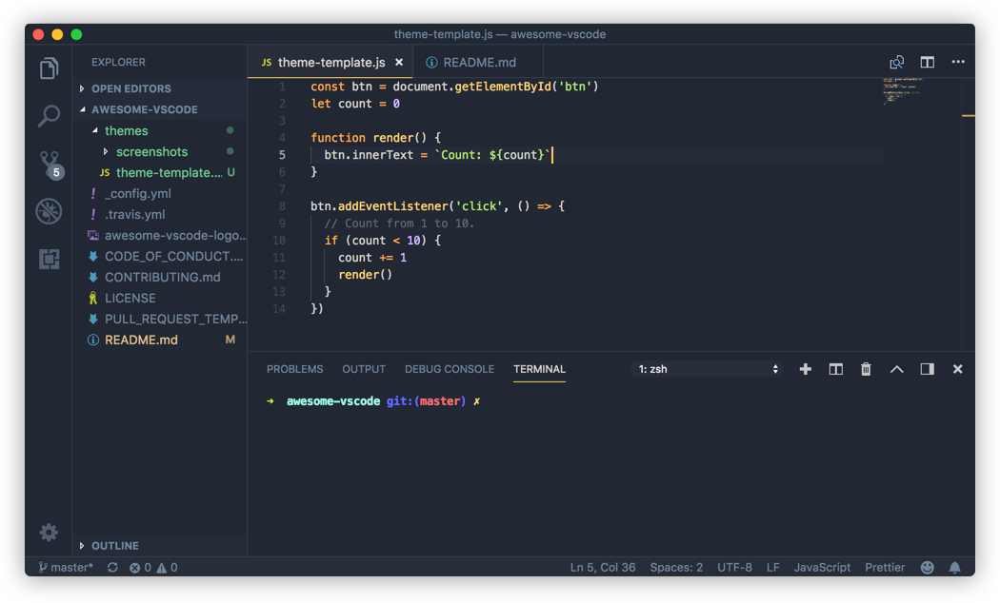
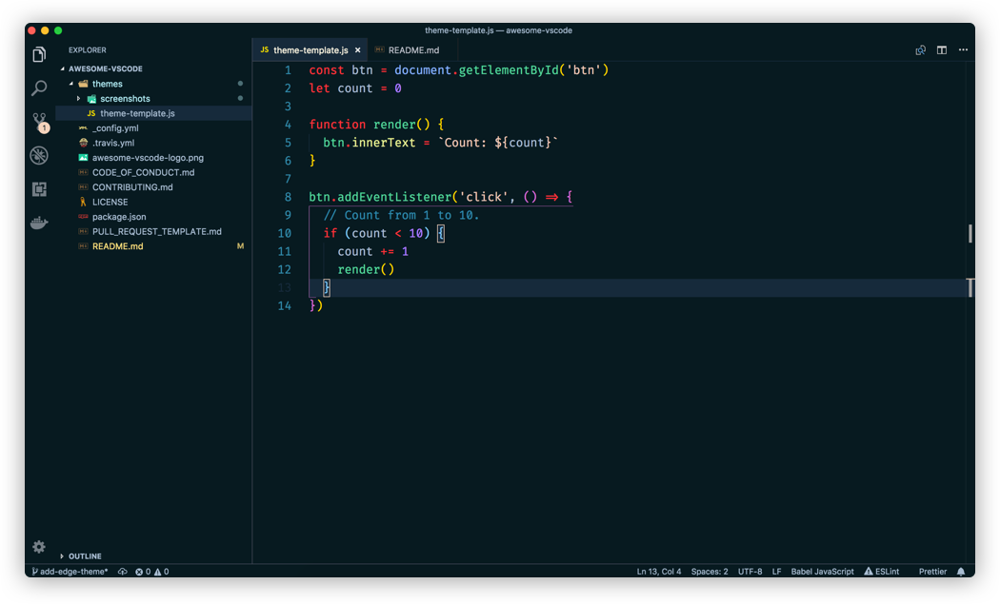
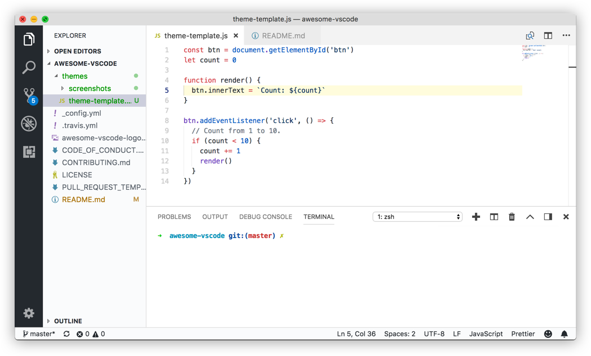
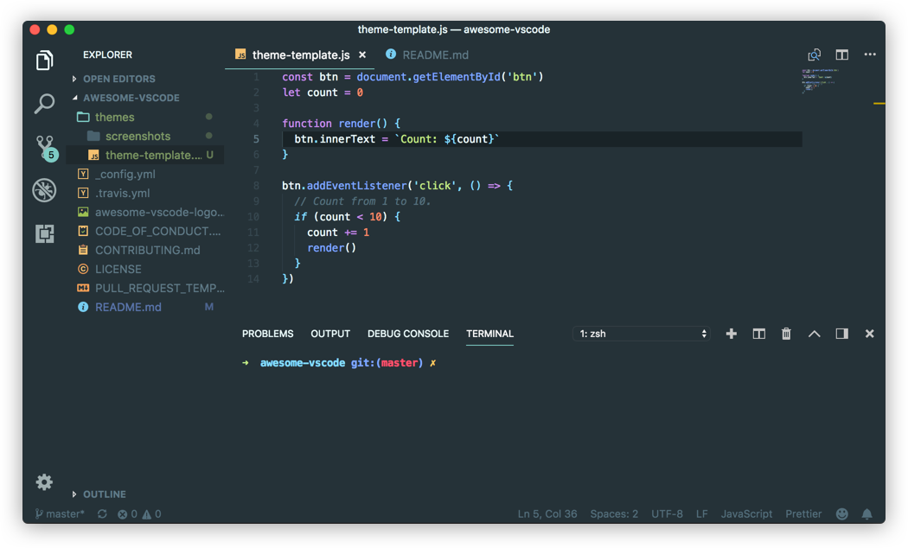
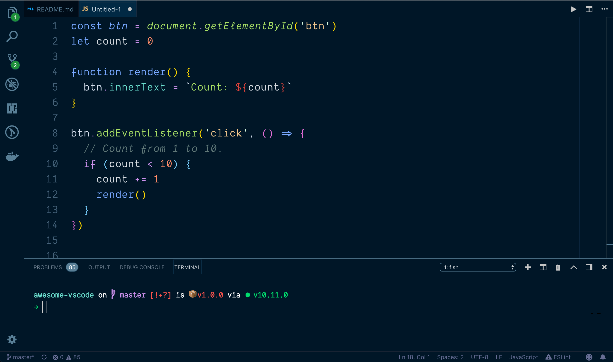
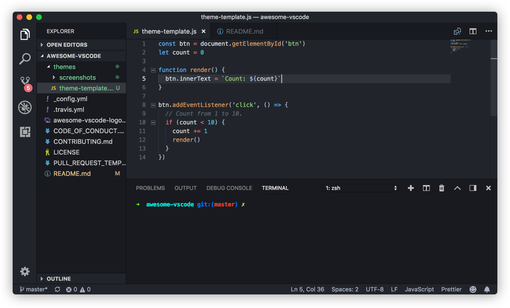
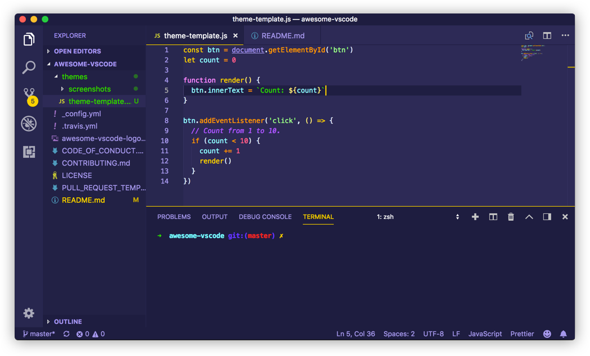

# viatsko/awesome-vscode [![translate-svg]][translate-list]

<!-- [![size-img]][size] -->

[translate-svg]: http://llever.com/translate.svg
[translate-list]: https://github.com/chinanf-boy/chinese-translate-list

「 🎨令人愉快的VS Code包和资源的精选列表 中文」

[中文](./readme.md) | [english](https://github.com/viatsko/awesome-vscode)

---

## 校对 ✅

<!-- doc-templite START generated -->
<!-- repo = 'viatsko/awesome-vscode' -->
<!-- commit = '3f21014dd86f0237990b33a57299aff2b5067ef5' -->
<!-- time = '2018-10-09' -->

| 翻译的原文 | 与日期        | 最新更新 | 更多                       |
| ---------- | ------------- | -------- | -------------------------- |
| [commit]   | ⏰ 2018-10-09 | ![last]  | [中文翻译][translate-list] |

[last]: https://img.shields.io/github/last-commit/viatsko/awesome-vscode.svg
[commit]: https://github.com/viatsko/awesome-vscode/tree/3f21014dd86f0237990b33a57299aff2b5067ef5

<!-- doc-templite END generated -->

### 贡献

欢迎 👏 勘误/校对/更新贡献 😊 [具体贡献请看](https://github.com/chinanf-boy/chinese-translate-list#贡献)

## 生活

[help me live , live need money 💰](https://github.com/chinanf-boy/live-need-money)

---

<br/>
<div align="center">
  
</div>
<br/>
<div align="center">

一份令人愉快的[VS Code](https://code.visualstudio.com/)包和资源清单.为了更精彩,请查看[awesome](https://github.com/sindresorhus/awesome).

[](https://github.com/sindresorhus/awesome) [](https://travis-ci.org/viatsko/awesome-vscode)

</div>
<br/>

# 目录表

<!-- START doctoc generated TOC please keep comment here to allow auto update -->
<!-- DON'T EDIT THIS SECTION, INSTEAD RE-RUN doctoc TO UPDATE -->
<!-- END doctoc -->

- [官方的](#%E5%AE%98%E6%96%B9%E7%9A%84)
- [语法](#%E8%AF%AD%E6%B3%95)
- [从其他编辑器迁移](#%E4%BB%8E%E5%85%B6%E4%BB%96%E7%BC%96%E8%BE%91%E5%99%A8%E8%BF%81%E7%A7%BB)
  - [从Vim迁移](#%E4%BB%8Evim%E8%BF%81%E7%A7%BB)
  - [atom迁移](#atom%E8%BF%81%E7%A7%BB)
  - [从Sublime Text迁移](#%E4%BB%8Esublime-text%E8%BF%81%E7%A7%BB)
  - [从Visual Studio迁移](#%E4%BB%8Evisual-studio%E8%BF%81%E7%A7%BB)
  - [从Intellij IDEA迁移](#%E4%BB%8Eintellij-idea%E8%BF%81%E7%A7%BB)
- [Lint与智能提示](#lint%E4%B8%8E%E6%99%BA%E8%83%BD%E6%8F%90%E7%A4%BA)
  - [1C](#1c)
  - [Bash](#bash)
  - [C++](#c)
  - [`C\#`](#c%5C)
  - [CSS](#css)
    - [CSS Peek](#css-peek)
  - [Go](#go)
  - [Haskell](#haskell)
  - [Shell](#shell)
  - [Java](#java)
  - [JavaScript](#javascript)
    - [Chrome调试器](#chrome%E8%B0%83%E8%AF%95%E5%99%A8)
  - [TypeScript](#typescript)
  - [Markdown](#markdown)
  - [PHP](#php)
    - [智能提示](#%E6%99%BA%E8%83%BD%E6%8F%90%E7%A4%BA)
    - [Laravel](#laravel)
    - [Twig](#twig)
    - [其他扩展](#%E5%85%B6%E4%BB%96%E6%89%A9%E5%B1%95)
    - [更多](#%E6%9B%B4%E5%A4%9A)
  - [Python](#python)
  - [ReasonML](#reasonml)
  - [Rust](#rust)
- [生产力](#%E7%94%9F%E4%BA%A7%E5%8A%9B)
  - [Azure Cosmos DB](#azure-cosmos-db)
  - [Azure IOT 工具包](#azure-iot-%E5%B7%A5%E5%85%B7%E5%8C%85)
  - [书签](#%E4%B9%A6%E7%AD%BE)
  - [创建测试](#%E5%88%9B%E5%BB%BA%E6%B5%8B%E8%AF%95)
  - [部署](#%E9%83%A8%E7%BD%B2)
    - [Gi](#gi)
  - [GIT历史](#git%E5%8E%86%E5%8F%B2)
  - [项目经理](#%E9%A1%B9%E7%9B%AE%E7%BB%8F%E7%90%86)
  - [GitLink](#gitlink)
  - [GitLens](#gitlens)
  - [GIT指标](#git%E6%8C%87%E6%A0%87)
  - [GitHub](#github)
  - [Github Pull请求监控器](#github-pull%E8%AF%B7%E6%B1%82%E7%9B%91%E6%8E%A7%E5%99%A8)
  - [Icon字体](#icon%E5%AD%97%E4%BD%93)
  - [JS参数注释](#js%E5%8F%82%E6%95%B0%E6%B3%A8%E9%87%8A)
  - [Kanban](#kanban)
  - [live服务器](#%08live%E6%9C%8D%E5%8A%A1%E5%99%A8)
  - [多剪贴板](#%E5%A4%9A%E5%89%AA%E8%B4%B4%E6%9D%BF)
  - [核心测试资源管理器](#%E6%A0%B8%E5%BF%83%E6%B5%8B%E8%AF%95%E8%B5%84%E6%BA%90%E7%AE%A1%E7%90%86%E5%99%A8)
  - [npm智能提示](#npm%E6%99%BA%E8%83%BD%E6%8F%90%E7%A4%BA)
  - [部分Diff](#%E9%83%A8%E5%88%86diff)
    - [将JSON解析成代码](#%E5%B0%86json%E8%A7%A3%E6%9E%90%E6%88%90%E4%BB%A3%E7%A0%81)
  - [路径感知](#%E8%B7%AF%E5%BE%84%E6%84%9F%E7%9F%A5)
  - [项目经理](#%E9%A1%B9%E7%9B%AE%E7%BB%8F%E7%90%86-1)
  - [REST客户端](#rest%E5%AE%A2%E6%88%B7%E7%AB%AF)
  - [设置同步](#%E8%AE%BE%E7%BD%AE%E5%90%8C%E6%AD%A5)
  - [Todo树](#todo%E6%A0%91)
  - [切换引号](#%E5%88%87%E6%8D%A2%E5%BC%95%E5%8F%B7)
  - [Yo](#yo)
- [格式化与美化](#%E6%A0%BC%E5%BC%8F%E5%8C%96%E4%B8%8E%E7%BE%8E%E5%8C%96)
  - [Better Align - 更好地对齐](#better-align---%E6%9B%B4%E5%A5%BD%E5%9C%B0%E5%AF%B9%E9%BD%90)
  - [自动关闭标签](#%E8%87%AA%E5%8A%A8%E5%85%B3%E9%97%AD%E6%A0%87%E7%AD%BE)
  - [自动重命名标签](#%E8%87%AA%E5%8A%A8%E9%87%8D%E5%91%BD%E5%90%8D%E6%A0%87%E7%AD%BE)
  - [beautify](#beautify)
    - [html2pug](#html2pug)
  - [ECMAScript 引号转换器](#ecmascript-%E5%BC%95%E5%8F%B7%E8%BD%AC%E6%8D%A2%E5%99%A8)
  - [粘贴和缩进](#%E7%B2%98%E8%B4%B4%E5%92%8C%E7%BC%A9%E8%BF%9B)
  - [排序线](#%E6%8E%92%E5%BA%8F%E7%BA%BF)
  - [Surround](#surround)
  - [包装选择](#%E5%8C%85%E8%A3%85%E9%80%89%E6%8B%A9)
  - [格式化开关](#%E6%A0%BC%E5%BC%8F%E5%8C%96%E5%BC%80%E5%85%B3)
  - [Bracket 颜色器对](#bracket-%E9%A2%9C%E8%89%B2%E5%99%A8%E5%AF%B9)
  - [自动导入](#%E8%87%AA%E5%8A%A8%E5%AF%BC%E5%85%A5)
  - [探险 Icons](#%E6%8E%A2%E9%99%A9-icons)
    - [城市灯光 Icons](#%E5%9F%8E%E5%B8%82%E7%81%AF%E5%85%89-icons)
    - [VScode Icons](#vscode-icons)
    - [Seti Icons](#seti-icons)
    - [Material Icons主题](#material-icons%E4%B8%BB%E9%A2%98)
- [未分类](#%E6%9C%AA%E5%88%86%E7%B1%BB)
  - [代码 运行器](#%E4%BB%A3%E7%A0%81-%E8%BF%90%E8%A1%8C%E5%99%A8)
  - [彩色高亮](#%E5%BD%A9%E8%89%B2%E9%AB%98%E4%BA%AE)
  - [颜色输出](#%E9%A2%9C%E8%89%B2%E8%BE%93%E5%87%BA)
  - [Dash](#dash)
  - [用shell命令编辑](#%E7%94%A8shell%E5%91%BD%E4%BB%A4%E7%BC%96%E8%BE%91)
  - [VScode编辑器配置](#vscode%E7%BC%96%E8%BE%91%E5%99%A8%E9%85%8D%E7%BD%AE)
  - [FTP同步](#ftp%E5%90%8C%E6%AD%A5)
  - [PlatformIO](#platformio)
  - [Polacode](#polacode)
  - [Quokka](#quokka)
  - [远程工作空间](#%E8%BF%9C%E7%A8%8B%E5%B7%A5%E4%BD%9C%E7%A9%BA%E9%97%B4)
  - [Runner](#runner)
  - [Slack](#slack)
    - [Spotify](#spotify)
  - [SVG阅读器](#svg%E9%98%85%E8%AF%BB%E5%99%A8)
  - [文本标记(萤光笔)](#%E6%96%87%E6%9C%AC%E6%A0%87%E8%AE%B0%E8%90%A4%E5%85%89%E7%AC%94)
- [主题](#%E4%B8%BB%E9%A2%98)
  - [用户界面](#%E7%94%A8%E6%88%B7%E7%95%8C%E9%9D%A2)
  - [语法](#%E8%AF%AD%E6%B3%95-1)
    - [An Old Hope Theme by Dustin Sanders](#an-old-hope-theme-by-dustin-sanders)
    - [Ariake Dark 来自 wart](#ariake-dark-%E6%9D%A5%E8%87%AA-wart)
    - [Atom One Dark Theme by Mahmoud Ali ](#atom-one-dark-theme-by-mahmoud-ali)
    - [Ayu by teabyii](#ayu-by-teabyii)
    - [Captain Sweetheart by ultradracula](#captain-sweetheart-by-ultradracula)
    - [City Lights by Yummygumm](#city-lights-by-yummygumm)
    - [Cobalt2 Theme Official by Wes Bos](#cobalt2-theme-official-by-wes-bos)
    - [Dracula Official by Dracula Theme](#dracula-official-by-dracula-theme)
    - [Edge by Bogdan Lazar](#edge-by-bogdan-lazar)
    - [Eva Theme by fisheva](#eva-theme-by-fisheva)
    - [Fairy Floss by nopjmp and sailorhg](#fairy-floss-by-nopjmp-and-sailorhg)
    - [GitHub Theme by Thomas Pink](#github-theme-by-thomas-pink)
    - [Material Palenight Theme by whizkydee](#material-palenight-theme-by-whizkydee)
    - [Material Theme by Mattia Astorino](#material-theme-by-mattia-astorino)
    - [Mno by u29dc](#mno-by-u29dc)
    - [Night Owl by Sarah Drasner](#night-owl-by-sarah-drasner)
    - [Plastic by Will Stone](#plastic-by-will-stone)
    - [Nord by arcticicestudio](#nord-by-arcticicestudio)
    - [Shades of Purple by Ahmad Awais](#shades-of-purple-by-ahmad-awais)
- [跟随的人](#%E8%B7%9F%E9%9A%8F%E7%9A%84%E4%BA%BA)
- [扩展开发者的资源](#%E6%89%A9%E5%B1%95%E5%BC%80%E5%8F%91%E8%80%85%E7%9A%84%E8%B5%84%E6%BA%90)
  - [文档](#%E6%96%87%E6%A1%A3)
  - [库](#%E5%BA%93)
  - [特别适合单元测试.](#%E7%89%B9%E5%88%AB%E9%80%82%E5%90%88%E5%8D%95%E5%85%83%E6%B5%8B%E8%AF%95)
- [贡献](#%E8%B4%A1%E7%8C%AE)
- [许可证](#%E8%AE%B8%E5%8F%AF%E8%AF%81)

<!-- END doctoc generated TOC please keep comment here to allow auto update -->

- [官方的](#%E5%AE%98%E6%96%B9%E7%9A%84)
- [语法](#%E8%AF%AD%E6%B3%95)
- [从其他编辑器迁移](#%E4%BB%8E%E5%85%B6%E4%BB%96%E7%BC%96%E8%BE%91%E5%99%A8%E8%BF%81%E7%A7%BB)
  - [从Vim迁移](#%E4%BB%8Evim%E8%BF%81%E7%A7%BB)
  - [atom迁移](#atom%E8%BF%81%E7%A7%BB)
  - [从Sublime Text迁移](#%E4%BB%8Esublime-text%E8%BF%81%E7%A7%BB)
  - [从Visual Studio迁移](#%E4%BB%8Evisual-studio%E8%BF%81%E7%A7%BB)
  - [从Intellij IDEA迁移](#%E4%BB%8Eintellij-idea%E8%BF%81%E7%A7%BB)
- [Lint与智能提示](#lint%E4%B8%8E%E6%99%BA%E8%83%BD%E6%8F%90%E7%A4%BA)
  - [1C](#1c)
  - [Bash](#bash)
  - [C++](#c)
  - [`C#`](#c)
  - [CSS](#css)
    - [CSS Peek](#css-peek)
  - [Go](#go)
  - [Haskell](#haskell)
  - [Shell](#shell)
  - [Java](#java)
  - [JavaScript](#javascript)
    - [Chrome调试器](#chrome%E8%B0%83%E8%AF%95%E5%99%A8)
  - [TypeScript](#typescript)
  - [Markdown](#markdown)
  - [PHP](#php)
    - [智能提示](#%E6%99%BA%E8%83%BD%E6%8F%90%E7%A4%BA)
    - [Laravel](#laravel)
    - [Twig](#twig)
    - [其他扩展](#%E5%85%B6%E4%BB%96%E6%89%A9%E5%B1%95)
    - [更多](#%E6%9B%B4%E5%A4%9A)
  - [Python](#python)
  - [ReasonML](#reasonml)
  - [Rust](#rust)
- [生产力](#%E7%94%9F%E4%BA%A7%E5%8A%9B)
  - [Azure Cosmos DB](#azure-cosmos-db)
  - [Azure IOT 工具包](#azure-iot-%E5%B7%A5%E5%85%B7%E5%8C%85)
  - [书签](#%E4%B9%A6%E7%AD%BE)
  - [创建测试](#%E5%88%9B%E5%BB%BA%E6%B5%8B%E8%AF%95)
  - [部署](#%E9%83%A8%E7%BD%B2)
    - [Gi](#gi)
  - [GIT历史](#git%E5%8E%86%E5%8F%B2)
  - [项目经理](#%E9%A1%B9%E7%9B%AE%E7%BB%8F%E7%90%86)
  - [GitLink](#gitlink)
  - [GitLens](#gitlens)
  - [GIT指标](#git%E6%8C%87%E6%A0%87)
  - [GitHub](#github)
  - [Github Pull请求监控器](#github-pull%E8%AF%B7%E6%B1%82%E7%9B%91%E6%8E%A7%E5%99%A8)
  - [Icon字体](#icon%E5%AD%97%E4%BD%93)
  - [JS参数注释](#js%E5%8F%82%E6%95%B0%E6%B3%A8%E9%87%8A)
  - [Kanban](#kanban)
  - [live服务器](#%08live%E6%9C%8D%E5%8A%A1%E5%99%A8)
  - [多剪贴板](#%E5%A4%9A%E5%89%AA%E8%B4%B4%E6%9D%BF)
  - [核心测试资源管理器](#%E6%A0%B8%E5%BF%83%E6%B5%8B%E8%AF%95%E8%B5%84%E6%BA%90%E7%AE%A1%E7%90%86%E5%99%A8)
  - [npm智能提示](#npm%E6%99%BA%E8%83%BD%E6%8F%90%E7%A4%BA)
  - [部分Diff](#%E9%83%A8%E5%88%86diff)
    - [将JSON解析成代码](#%E5%B0%86json%E8%A7%A3%E6%9E%90%E6%88%90%E4%BB%A3%E7%A0%81)
  - [路径感知](#%E8%B7%AF%E5%BE%84%E6%84%9F%E7%9F%A5)
  - [项目经理](#%E9%A1%B9%E7%9B%AE%E7%BB%8F%E7%90%86-1)
  - [REST客户端](#rest%E5%AE%A2%E6%88%B7%E7%AB%AF)
  - [设置同步](#%E8%AE%BE%E7%BD%AE%E5%90%8C%E6%AD%A5)
  - [Todo树](#todo%E6%A0%91)
  - [切换引号](#%E5%88%87%E6%8D%A2%E5%BC%95%E5%8F%B7)
  - [Yo](#yo)
- [格式化与美化](#%E6%A0%BC%E5%BC%8F%E5%8C%96%E4%B8%8E%E7%BE%8E%E5%8C%96)
  - [Better Align - 更好地对齐](#better-align---%E6%9B%B4%E5%A5%BD%E5%9C%B0%E5%AF%B9%E9%BD%90)
  - [自动关闭标签](#%E8%87%AA%E5%8A%A8%E5%85%B3%E9%97%AD%E6%A0%87%E7%AD%BE)
  - [自动重命名标签](#%E8%87%AA%E5%8A%A8%E9%87%8D%E5%91%BD%E5%90%8D%E6%A0%87%E7%AD%BE)
  - [beautify](#beautify)
    - [html2pug](#html2pug)
  - [ECMAScript 引号转换器](#ecmascript-%E5%BC%95%E5%8F%B7%E8%BD%AC%E6%8D%A2%E5%99%A8)
  - [粘贴和缩进](#%E7%B2%98%E8%B4%B4%E5%92%8C%E7%BC%A9%E8%BF%9B)
  - [排序线](#%E6%8E%92%E5%BA%8F%E7%BA%BF)
  - [Surround](#surround)
  - [包装选择](#%E5%8C%85%E8%A3%85%E9%80%89%E6%8B%A9)
  - [格式化开关](#%E6%A0%BC%E5%BC%8F%E5%8C%96%E5%BC%80%E5%85%B3)
  - [Bracket 颜色器对](#bracket-%E9%A2%9C%E8%89%B2%E5%99%A8%E5%AF%B9)
  - [自动导入](#%E8%87%AA%E5%8A%A8%E5%AF%BC%E5%85%A5)
  - [探险 Icons](#%E6%8E%A2%E9%99%A9-icons)
    - [城市灯光 Icons](#%E5%9F%8E%E5%B8%82%E7%81%AF%E5%85%89-icons)
    - [VScode Icons](#vscode-icons)
    - [Seti Icons](#seti-icons)
    - [Material Icons主题](#material-icons%E4%B8%BB%E9%A2%98)
- [未分类](#%E6%9C%AA%E5%88%86%E7%B1%BB)
  - [代码 运行器](#%E4%BB%A3%E7%A0%81-%E8%BF%90%E8%A1%8C%E5%99%A8)
  - [彩色高亮](#%E5%BD%A9%E8%89%B2%E9%AB%98%E4%BA%AE)
  - [颜色输出](#%E9%A2%9C%E8%89%B2%E8%BE%93%E5%87%BA)
  - [Dash](#dash)
  - [用shell命令编辑](#%E7%94%A8shell%E5%91%BD%E4%BB%A4%E7%BC%96%E8%BE%91)
  - [VScode编辑器配置](#vscode%E7%BC%96%E8%BE%91%E5%99%A8%E9%85%8D%E7%BD%AE)
  - [FTP同步](#ftp%E5%90%8C%E6%AD%A5)
  - [PlatformIO](#platformio)
  - [Polacode](#polacode)
  - [Quokka](#quokka)
  - [远程工作空间](#%E8%BF%9C%E7%A8%8B%E5%B7%A5%E4%BD%9C%E7%A9%BA%E9%97%B4)
  - [Runner](#runner)
  - [Slack](#slack)
    - [Spotify](#spotify)
  - [SVG阅读器](#svg%E9%98%85%E8%AF%BB%E5%99%A8)
  - [文本标记(萤光笔)](#%E6%96%87%E6%9C%AC%E6%A0%87%E8%AE%B0%E8%90%A4%E5%85%89%E7%AC%94)
- [主题](#%E4%B8%BB%E9%A2%98)
  - [用户界面](#%E7%94%A8%E6%88%B7%E7%95%8C%E9%9D%A2)
  - [语法](#%E8%AF%AD%E6%B3%95-1)
    - [An Old Hope Theme by Dustin Sanders](#an-old-hope-theme-by-dustin-sanders)
    - [Ariake Dark 来自 wart](#ariake-dark-%E6%9D%A5%E8%87%AA-wart)
    - [Atom One Dark Theme by Mahmoud Ali ](#atom-one-dark-theme-by-mahmoud-ali)
    - [Ayu by teabyii](#ayu-by-teabyii)
    - [Captain Sweetheart by ultradracula](#captain-sweetheart-by-ultradracula)
    - [City Lights by Yummygumm](#city-lights-by-yummygumm)
    - [Cobalt2 Theme Official by Wes Bos](#cobalt2-theme-official-by-wes-bos)
    - [Dracula Official by Dracula Theme](#dracula-official-by-dracula-theme)
    - [Edge by Bogdan Lazar](#edge-by-bogdan-lazar)
    - [Eva Theme by fisheva](#eva-theme-by-fisheva)
    - [Fairy Floss by nopjmp and sailorhg](#fairy-floss-by-nopjmp-and-sailorhg)
    - [GitHub Theme by Thomas Pink](#github-theme-by-thomas-pink)
    - [Material Palenight Theme by whizkydee](#material-palenight-theme-by-whizkydee)
    - [Material Theme by Mattia Astorino](#material-theme-by-mattia-astorino)
    - [Mno by u29dc](#mno-by-u29dc)
    - [Night Owl by Sarah Drasner](#night-owl-by-sarah-drasner)
    - [Plastic by Will Stone](#plastic-by-will-stone)
    - [Nord by arcticicestudio](#nord-by-arcticicestudio)
    - [Shades of Purple by Ahmad Awais](#shades-of-purple-by-ahmad-awais)
- [跟随的人](#%E8%B7%9F%E9%9A%8F%E7%9A%84%E4%BA%BA)
- [扩展开发者的资源](#%E6%89%A9%E5%B1%95%E5%BC%80%E5%8F%91%E8%80%85%E7%9A%84%E8%B5%84%E6%BA%90)
  - [文档](#%E6%96%87%E6%A1%A3)
  - [库](#%E5%BA%93)
  - [特别适合单元测试.](#%E7%89%B9%E5%88%AB%E9%80%82%E5%90%88%E5%8D%95%E5%85%83%E6%B5%8B%E8%AF%95)
- [贡献](#%E8%B4%A1%E7%8C%AE)
- [许可证](#%E8%AE%B8%E5%8F%AF%E8%AF%81)

<!-- END doctoc generated TOC please keep comment here to allow auto update -->

- [官方的](#%E5%AE%98%E6%96%B9%E7%9A%84)
- [语法](#%E8%AF%AD%E6%B3%95)
- [从其他编辑器迁移](#%E4%BB%8E%E5%85%B6%E4%BB%96%E7%BC%96%E8%BE%91%E5%99%A8%E8%BF%81%E7%A7%BB)
  - [从Vim迁移](#%E4%BB%8Evim%E8%BF%81%E7%A7%BB)
  - [atom迁移](#atom%E8%BF%81%E7%A7%BB)
  - [从Sublime Text迁移](#%E4%BB%8Esublime-text%E8%BF%81%E7%A7%BB)
  - [从Visual Studio迁移](#%E4%BB%8Evisual-studio%E8%BF%81%E7%A7%BB)
  - [从Intellij IDEA迁移](#%E4%BB%8Eintellij-idea%E8%BF%81%E7%A7%BB)
- [Lint与智能提示](#lint%E4%B8%8E%E6%99%BA%E8%83%BD%E6%8F%90%E7%A4%BA)
  - [1C](#1c)
  - [Bash](#bash)
  - [C++](#c)
  - [C\](#c%5C)
  - [CSS](#css)
    - [CSS Peek](#css-peek)
  - [Go](#go)
  - [Haskell](#haskell)
  - [Shell](#shell)
  - [Java](#java)
  - [JavaScript](#javascript)
    - [Chrome调试器](#chrome%E8%B0%83%E8%AF%95%E5%99%A8)
  - [TypeScript](#typescript)
  - [Markdown](#markdown)
  - [PHP](#php)
    - [智能提示](#%E6%99%BA%E8%83%BD%E6%8F%90%E7%A4%BA)
    - [Laravel](#laravel)
    - [Twig](#twig)
    - [其他扩展](#%E5%85%B6%E4%BB%96%E6%89%A9%E5%B1%95)
    - [更多](#%E6%9B%B4%E5%A4%9A)
  - [Python](#python)
  - [ReasonML](#reasonml)
  - [Rust](#rust)
- [生产力](#%E7%94%9F%E4%BA%A7%E5%8A%9B)
  - [Azure Cosmos DB](#azure-cosmos-db)
  - [Azure IOT 工具包](#azure-iot-%E5%B7%A5%E5%85%B7%E5%8C%85)
  - [书签](#%E4%B9%A6%E7%AD%BE)
  - [创建测试](#%E5%88%9B%E5%BB%BA%E6%B5%8B%E8%AF%95)
  - [部署](#%E9%83%A8%E7%BD%B2)
    - [Gi](#gi)
  - [GIT历史](#git%E5%8E%86%E5%8F%B2)
  - [项目经理](#%E9%A1%B9%E7%9B%AE%E7%BB%8F%E7%90%86)
  - [GitLink](#gitlink)
  - [GitLens](#gitlens)
  - [GIT指标](#git%E6%8C%87%E6%A0%87)
  - [GitHub](#github)
  - [Github Pull请求监控器](#github-pull%E8%AF%B7%E6%B1%82%E7%9B%91%E6%8E%A7%E5%99%A8)
  - [Icon字体](#icon%E5%AD%97%E4%BD%93)
  - [JS参数注释](#js%E5%8F%82%E6%95%B0%E6%B3%A8%E9%87%8A)
  - [Kanban](#kanban)
  - [live服务器](#%08live%E6%9C%8D%E5%8A%A1%E5%99%A8)
  - [多剪贴板](#%E5%A4%9A%E5%89%AA%E8%B4%B4%E6%9D%BF)
  - [核心测试资源管理器](#%E6%A0%B8%E5%BF%83%E6%B5%8B%E8%AF%95%E8%B5%84%E6%BA%90%E7%AE%A1%E7%90%86%E5%99%A8)
  - [npm智能提示](#npm%E6%99%BA%E8%83%BD%E6%8F%90%E7%A4%BA)
  - [部分Diff](#%E9%83%A8%E5%88%86diff)
    - [将JSON解析成代码](#%E5%B0%86json%E8%A7%A3%E6%9E%90%E6%88%90%E4%BB%A3%E7%A0%81)
  - [路径感知](#%E8%B7%AF%E5%BE%84%E6%84%9F%E7%9F%A5)
  - [项目经理](#%E9%A1%B9%E7%9B%AE%E7%BB%8F%E7%90%86-1)
  - [REST客户端](#rest%E5%AE%A2%E6%88%B7%E7%AB%AF)
  - [设置同步](#%E8%AE%BE%E7%BD%AE%E5%90%8C%E6%AD%A5)
  - [Todo树](#todo%E6%A0%91)
  - [切换引号](#%E5%88%87%E6%8D%A2%E5%BC%95%E5%8F%B7)
  - [Yo](#yo)
- [格式化与美化](#%E6%A0%BC%E5%BC%8F%E5%8C%96%E4%B8%8E%E7%BE%8E%E5%8C%96)
  - [Better Align - 更好地对齐](#better-align---%E6%9B%B4%E5%A5%BD%E5%9C%B0%E5%AF%B9%E9%BD%90)
  - [自动关闭标签](#%E8%87%AA%E5%8A%A8%E5%85%B3%E9%97%AD%E6%A0%87%E7%AD%BE)
  - [自动重命名标签](#%E8%87%AA%E5%8A%A8%E9%87%8D%E5%91%BD%E5%90%8D%E6%A0%87%E7%AD%BE)
  - [beautify](#beautify)
    - [html2pug](#html2pug)
  - [ECMAScript 引号转换器](#ecmascript-%E5%BC%95%E5%8F%B7%E8%BD%AC%E6%8D%A2%E5%99%A8)
  - [粘贴和缩进](#%E7%B2%98%E8%B4%B4%E5%92%8C%E7%BC%A9%E8%BF%9B)
  - [排序线](#%E6%8E%92%E5%BA%8F%E7%BA%BF)
  - [Surround](#surround)
  - [包装选择](#%E5%8C%85%E8%A3%85%E9%80%89%E6%8B%A9)
  - [格式化开关](#%E6%A0%BC%E5%BC%8F%E5%8C%96%E5%BC%80%E5%85%B3)
  - [Bracket 颜色器对](#bracket-%E9%A2%9C%E8%89%B2%E5%99%A8%E5%AF%B9)
  - [自动导入](#%E8%87%AA%E5%8A%A8%E5%AF%BC%E5%85%A5)
  - [探险 Icons](#%E6%8E%A2%E9%99%A9-icons)
    - [城市灯光 Icons](#%E5%9F%8E%E5%B8%82%E7%81%AF%E5%85%89-icons)
    - [VScode Icons](#vscode-icons)
    - [Seti Icons](#seti-icons)
    - [Material Icons主题](#material-icons%E4%B8%BB%E9%A2%98)
- [未分类](#%E6%9C%AA%E5%88%86%E7%B1%BB)
  - [代码 运行器](#%E4%BB%A3%E7%A0%81-%E8%BF%90%E8%A1%8C%E5%99%A8)
  - [彩色高亮](#%E5%BD%A9%E8%89%B2%E9%AB%98%E4%BA%AE)
  - [颜色输出](#%E9%A2%9C%E8%89%B2%E8%BE%93%E5%87%BA)
  - [Dash](#dash)
  - [用shell命令编辑](#%E7%94%A8shell%E5%91%BD%E4%BB%A4%E7%BC%96%E8%BE%91)
  - [VScode编辑器配置](#vscode%E7%BC%96%E8%BE%91%E5%99%A8%E9%85%8D%E7%BD%AE)
  - [FTP同步](#ftp%E5%90%8C%E6%AD%A5)
  - [PlatformIO](#platformio)
  - [Polacode](#polacode)
  - [Quokka](#quokka)
  - [远程工作空间](#%E8%BF%9C%E7%A8%8B%E5%B7%A5%E4%BD%9C%E7%A9%BA%E9%97%B4)
  - [Runner](#runner)
  - [Slack](#slack)
    - [Spotify](#spotify)
  - [SVG阅读器](#svg%E9%98%85%E8%AF%BB%E5%99%A8)
  - [文本标记(萤光笔)](#%E6%96%87%E6%9C%AC%E6%A0%87%E8%AE%B0%E8%90%A4%E5%85%89%E7%AC%94)
- [主题](#%E4%B8%BB%E9%A2%98)
  - [用户界面](#%E7%94%A8%E6%88%B7%E7%95%8C%E9%9D%A2)
  - [语法](#%E8%AF%AD%E6%B3%95-1)
    - [An Old Hope Theme by Dustin Sanders](#an-old-hope-theme-by-dustin-sanders)
    - [Ariake Dark 来自 wart](#ariake-dark-%E6%9D%A5%E8%87%AA-wart)
    - [Atom One Dark Theme by Mahmoud Ali ](#atom-one-dark-theme-by-mahmoud-ali)
    - [Ayu by teabyii](#ayu-by-teabyii)
    - [Captain Sweetheart by ultradracula](#captain-sweetheart-by-ultradracula)
    - [City Lights by Yummygumm](#city-lights-by-yummygumm)
    - [Cobalt2 Theme Official by Wes Bos](#cobalt2-theme-official-by-wes-bos)
    - [Dracula Official by Dracula Theme](#dracula-official-by-dracula-theme)
    - [Edge by Bogdan Lazar](#edge-by-bogdan-lazar)
    - [Eva Theme by fisheva](#eva-theme-by-fisheva)
    - [Fairy Floss by nopjmp and sailorhg](#fairy-floss-by-nopjmp-and-sailorhg)
    - [GitHub Theme by Thomas Pink](#github-theme-by-thomas-pink)
    - [Material Palenight Theme by whizkydee](#material-palenight-theme-by-whizkydee)
    - [Material Theme by Mattia Astorino](#material-theme-by-mattia-astorino)
    - [Mno by u29dc](#mno-by-u29dc)
    - [Night Owl by Sarah Drasner](#night-owl-by-sarah-drasner)
    - [Plastic by Will Stone](#plastic-by-will-stone)
    - [Nord by arcticicestudio](#nord-by-arcticicestudio)
    - [Shades of Purple by Ahmad Awais](#shades-of-purple-by-ahmad-awais)
- [跟随的人](#%E8%B7%9F%E9%9A%8F%E7%9A%84%E4%BA%BA)
- [扩展开发者的资源](#%E6%89%A9%E5%B1%95%E5%BC%80%E5%8F%91%E8%80%85%E7%9A%84%E8%B5%84%E6%BA%90)
  - [文档](#%E6%96%87%E6%A1%A3)
  - [库](#%E5%BA%93)
  - [特别适合单元测试.](#%E7%89%B9%E5%88%AB%E9%80%82%E5%90%88%E5%8D%95%E5%85%83%E6%B5%8B%E8%AF%95)
- [贡献](#%E8%B4%A1%E7%8C%AE)
- [许可证](#%E8%AE%B8%E5%8F%AF%E8%AF%81)

<!-- END doctoc generated TOC please keep comment here to allow auto update -->

# 官方的

-   [官方网站](https://code.visualstudio.com/)
-   [源代码](https://github.com/microsoft/vscode) github
-   [版本(稳定)](https://code.visualstudio.com/download)
-   [版本(内部渠道)](https://code.visualstudio.com/insiders)
-   [每月迭代计划](https://github.com/Microsoft/vscode/issues?utf8=%E2%9C%93&q=label%3Aiteration-plan+)

# 语法

语言包用语法高亮和或片段来扩展编辑器,应对特定的语言或文件格式.

- [Arduino](https://marketplace.visualstudio.com/items?itemName=vsciot-vscode.vscode-arduino)
- [Blink](https://marketplace.visualstudio.com/items?itemName=melmass.blink)
- [Bolt](https://marketplace.visualstudio.com/items?itemName=smkamranqadri.vscode-bolt-language)
- [Bond](https://marketplace.visualstudio.com/items?itemName=vicey.vscode-bond)
- [CMake](https://marketplace.visualstudio.com/items?itemName=twxs.cmake)
- [Dart](https://marketplace.visualstudio.com/items?itemName=Dart-Code.dart-code)
- [Dockerfile](https://marketplace.visualstudio.com/items?itemName=PeterJausovec.vscode-docker)
- [EJS](https://marketplace.visualstudio.com/items?itemName=QassimFarid.ejs-language-support)
- [Elixir](https://marketplace.visualstudio.com/items?itemName=mjmcloug.vscode-elixir)
- [Elm](https://marketplace.visualstudio.com/items?itemName=sbrink.elm)
- [Erlang](https://marketplace.visualstudio.com/items?itemName=pgourlain.erlang)
- [F#](https://marketplace.visualstudio.com/items?itemName=Ionide.Ionide-fsharp)
- [Flatbuffers](https://marketplace.visualstudio.com/items?itemName=gaborv.flatbuffers)
- [Fortran](https://marketplace.visualstudio.com/items?itemName=Gimly81.fortran)
- [Hack(HHVM)](https://marketplace.visualstudio.com/items?itemName=pranayagarwal.vscode-hack)
- [Handlebars](https://marketplace.visualstudio.com/items?itemName=andrejunges.Handlebars)
- [Hive SQL](https://marketplace.visualstudio.com/items?itemName=josephtbradley.hive-sql)
- [KL](https://marketplace.visualstudio.com/items?itemName=melmass.kl)
- [Kotlin](https://marketplace.visualstudio.com/items?itemName=mathiasfrohlich.Kotlin)
- [LaTeX](https://marketplace.visualstudio.com/items?itemName=torn4dom4n.latex-support)
- [Mason](https://marketplace.visualstudio.com/items?itemName=viatsko.html-mason)
- [openHAB](https://marketplace.visualstudio.com/items?itemName=openhab.openhab)
- [Parser 3](https://marketplace.visualstudio.com/items?itemName=viatsko.parser3)
- [Pascal](https://marketplace.visualstudio.com/items?itemName=alefragnani.pascal)或[OmniPascal](https://marketplace.visualstudio.com/items?itemName=Wosi.omnipascal)(仅适用于Windows)
- [Perl HTML-Template](https://marketplace.visualstudio.com/items?itemName=viatsko.perl-html-template)
- [Protobuf](https://marketplace.visualstudio.com/items?itemName=peterj.proto)
- [Ruby](https://marketplace.visualstudio.com/items?itemName=groksrc.ruby)
- [Scala](https://marketplace.visualstudio.com/items?itemName=itryapitsin.Scala)
- [Stylus](https://marketplace.visualstudio.com/items?itemName=sysoev.language-stylus)
- [Swift](https://marketplace.visualstudio.com/items?itemName=Kasik96.swift)
- [VEX](https://marketplace.visualstudio.com/items?itemName=melmass.vex)
- [Zephir](https://marketplace.visualstudio.com/items?itemName=zephir-lang.zephir)

# 从其他编辑器迁移

VSCode团队为流行的编辑器中提供Keymaps,使得过渡VSCode几乎是无缝和简单的.

## [从Vim迁移](https://marketplace.visualstudio.com/items?itemName=vscodevim.vim)

> **Vim模式**-新的但有希望的扩展,在VSCode中实现Vim特性的.作者建议加入他们的[Slack通道](https://vscodevim-slackin.azurewebsites.net/)行列, 参与您最喜爱的Vim功能的特性请求

## [atom迁移](https://marketplace.visualstudio.com/items?itemName=ms-vscode.atom-keybindings)

> 给VSCode 的 流行atom 按键绑定

## [从Sublime Text迁移](https://marketplace.visualstudio.com/items?itemName=ms-vscode.sublime-keybindings)

> 给VScode的 流行Sublime Text按键绑定.

## [从Visual Studio迁移](https://marketplace.visualstudio.com/items?itemName=ms-vscode.vs-keybindings)

> 给VScode的流行VisualStudio按键绑定.

## [从Intellij IDEA迁移](https://marketplace.visualstudio.com/items?itemName=k--kato.intellij-idea-keybindings)

> 给VScode的流行Intellij IDEA按键绑定.

# Lint与智能提示

即将到来的awesome必杀技linting尚未释放出来:

> lint最初是给一个特定的程序起的名字,这个程序在C语言源代码中标记了一些可疑的和不可移植的构造(可能是bug).这个术语现在普遍应用于标记出任何计算机语言编写软件的可疑用法的工具.

与其他一些编辑器不同,VScode支持智能提示、linting、开箱即用,并且不需要任何单独的扩展来运行linter包.有些linters已经集成在VScode中,您可以在正式文档[languages](https://code.visualstudio.com/Docs/languages/overview)章节中找到完整的列表.

## 1C

-   [1C/OScript](https://marketplace.visualstudio.com/items?itemName=xDrivenDevelopment.language-1c-bsl)- 富 1С:Enterprise 8 (BSL)语言支持- 添加`*.bsl` и `*.os files`语法突出显示,添加智能提示和语法帮助器


## Bash

-   [Bash IDE](https://marketplace.visualstudio.com/items?itemName=mads-hartmann.bash-ide-vscode)

## C++

-   [C/C++](https://marketplace.visualstudio.com/items?itemName=ms-vscode.cpptools)-预览C/C++扩展来自[微软](https://www.microsoft.com),读[官方博客帖子](https://blogs.msdn.microsoft.com/vcblog/2016/03/31/cc-extension-for-visual-studio-code/)细节问题
- [gnu-global-tags](https://marketplace.visualstudio.com/items?itemName=austin.code-gnu-global)-在GNU全局工具的帮助下为C/C++提供智能提示.
- [YouCompleteMe](https://marketplace.visualstudio.com/items?itemName=RichardHe.you-complete-me)-为C/C++ (和用[YouCompleteMe](http://valloric.github.io/YouCompleteMe/)为TypeScript、JavaScript、Objtovi-C、Golang、Rust)提供语义完整性.
-   [C/C++ Clang Command Adapter命令适配器](https://github.com/mitaki28/vscode-clang)-使用Clang命令为`C/C++/Objective-C`补全和诊断.

## `C\#`

-   [C#](https://marketplace.visualstudio.com/items?itemName=ms-vscode.csharp)-预览C\#扩展来自[微软](https://www.microsoft.com),读[官方文件](https://code.visualstudio.com/docs/languages/csharp)细节问题

-   [C# fix格式](https://marketplace.visualstudio.com/items?itemName=Leopotam.csharpfixformat)-使用/缩进/括号/空行的fix格式

-   [C# 扩展](https://marketplace.visualstudio.com/items?itemName=jchannon.csharpextensions)-为IDE提供扩展,从而加快开发流程.


## CSS

### [CSS Peek](https://marketplace.visualstudio.com/items?itemName=pranaygp.vscode-css-peek)

> 直接从HTML窥视或跳转到CSS定义,就像在括号里!


- [stylelint](https://marketplace.visualstudio.com/items?itemName=shinnn.stylelint)- lint CSS/SCSS.
- [Autoprefixer](https://marketplace.visualstudio.com/items?itemName=mrmlnc.vscode-autoprefixer)解析CSS,SCSS,LESS,并自动添加供应商前缀.
    

-   [CSS class名的智能提示](https://marketplace.visualstudio.com/items?itemName=Zignd.html-css-class-completion)-基于工作区中的CSS文件,为HTML类属性提供CSS类名补全.也支持React's className属性.

    

## Go

-   [Go](https://marketplace.visualstudio.com/items?itemName=ms-vscode.Go)- GO语言的丰富的语言支持.

## Haskell

-   [haskell-linter](https://marketplace.visualstudio.com/items?itemName=hoovercj.haskell-linter)

## Shell

-   [autocomplate-shell](https://marketplace.visualstudio.com/items?itemName=truman.autocomplate-shell)

## Java

-   [Red Hat对Java(TM)的语言支持](https://marketplace.visualstudio.com/items?itemName=redhat.java)
-   [Java调试器](https://marketplace.visualstudio.com/items?itemName=vscjava.vscode-java-debug)
    
-   [Java的Maven](https://marketplace.visualstudio.com/items?itemName=vscjava.vscode-maven)

-   [Lombok](https://marketplace.visualstudio.com/items?itemName=GabrielBB.vscode-lombok)

## JavaScript

-   [Babel JavaScript](https://marketplace.visualstudio.com/items?itemName=mgmcdermott.vscode-language-babel)
-   [Sublime的Babel](https://marketplace.visualstudio.com/items?itemName=joshpeng.sublime-babel-vscode#overview)从Sublime Text移植的Babel扩展

看到这两个之间的区别[在这里](https://github.com/michaelgmcd/vscode-language-babel/issues/1)

-   [tslint](https://marketplace.visualstudio.com/items?itemName=eg2.tslint)- VScode 的 TSLint(与`"tslint.jsEnable": true`)
-   [eslint](https://marketplace.visualstudio.com/items?itemName=dbaeumer.vscode-eslint)-[eslint](https://eslint.org/)lint.
-   [XO](https://marketplace.visualstudio.com/items?itemName=samverschueren.linter-xo)-[XO](https://github.com/xojs/xo)lint.
-   [AVA](https://marketplace.visualstudio.com/items?itemName=samverschueren.ava)-[AVA](https://github.com/avajs/ava)语法段.
-   [Prettier](https://marketplace.visualstudio.com/items?itemName=esbenp.prettier-vscode)- [漂亮的](https://github.com/prettier/prettier-vscode)Lint、格式化程序和漂亮打印机.

### [Chrome调试器](https://marketplace.visualstudio.com/items?itemName=msjsdiag.debugger-for-chrome)

> 一个VScode扩展,用于调试Chrome浏览器中的JavaScript代码,或者支持Chrome调试协议的其他目标.


## TypeScript

-   [tslint](https://marketplace.visualstudio.com/items?itemName=eg2.tslint)- VScode 的 TSLint

## Markdown

-   [markdownlint](https://marketplace.visualstudio.com/items?itemName=DavidAnson.vscode-markdownlint)-[markdownlint](https://github.com/DavidAnson/markdownlint)lint.

## PHP

### 智能提示

这些扩展提供了稍微不同的功能集合.虽然第一个提供更好的自动补全支持,第二个似乎整体有更多的功能.

-   [PHP Intelephense](https://marketplace.visualstudio.com/items?itemName=bmewburn.vscode-intelephense-client)
-   [PHP IntelliSense](https://marketplace.visualstudio.com/items?itemName=felixfbecker.php-intellisense)

### Laravel

-   [Laravel 5 语法段](https://marketplace.visualstudio.com/items?itemName=onecentlin.laravel5-snippets)-用于Visual Studio代码的LARAVEL 5 语法段
-   [Laravel Blade 语法段](https://marketplace.visualstudio.com/items?itemName=onecentlin.laravel-blade)- Laravel blade 语法段和语法突出显示支持


-   [Laravel Model 语法段](https://marketplace.visualstudio.com/items?itemName=ahinkle.laravel-model-snippets)-快速使用Laravel模型和运行模型.


-   [Laravel Artisan](https://marketplace.visualstudio.com/items?itemName=ryannaddy.laravel-artisan) VSCode中的Laravel Artisan命令


-   [DotENV](https://marketplace.visualstudio.com/items?itemName=mikestead.dotenv)-支持DOTENV文件语法


### Twig

-   [Twig 2](https://marketplace.visualstudio.com/items?itemName=mblode.twig-language-2)

要在`.twig`文件中启用Emmet支持,您需要在以下设置中,设置以下内容:

```json
{
  "emmet.includeLanguages": {
    "twig": "html"
  }
}
```

### 其他扩展

-   [Composer](https://marketplace.visualstudio.com/items?itemName=ikappas.composer)
-   [PHP调试](https://marketplace.visualstudio.com/items?itemName=felixfbecker.php-debug) XDebug VSCode扩展
-   [PHP 文档器](https://marketplace.visualstudio.com/items?itemName=neilbrayfield.php-docblocker)
-   [PHP CS fixer](https://marketplace.visualstudio.com/items?itemName=junstyle.php-cs-fixer) PHP CS fixer扩展,PHP格式化程序,PHP代码美化工具
-   [phpcs](https://marketplace.visualstudio.com/items?itemName=ikappas.phpcs) VSCode的PHP CodeSniffer
-   [phpfmt](https://marketplace.visualstudio.com/items?itemName=kokororin.vscode-phpfmt) 用于VSCode的phpfmt

### 更多

-   [为Drupal配置VSCode](https://www.drupal.org/docs/develop/development-tools/configuring-visual-studio-code)

## Python

-   [Python](https://marketplace.visualstudio.com/items?itemName=ms-python.python)- Linting、调试(多线程、Web应用程序)、智能提示、自动补全、代码格式化、代码段、单元测试等等.

## ReasonML

-   [ReasonML](https://marketplace.visualstudio.com/items?itemName=jaredly.reason-vscode)智能提示、代码格式化、重构、代码长等

## Rust

-   [Rust](https://marketplace.visualstudio.com/items?itemName=kalitaalexey.vscode-rust)- Linting、自动补全、代码格式化、片段和更多

# 生产力

## [Azure Cosmos DB](https://marketplace.visualstudio.com/items?itemName=ms-azuretools.vscode-cosmosdb)

> 在VScode编辑器中浏览数据库


## [Azure IOT 工具包](https://marketplace.visualstudio.com/items?itemName=vsciot-vscode.azure-iot-toolkit)

> Azure IoT开发所需的一切:与Azure IoT集线器交互,管理连接到Azure IoT集线器的设备,并用Azure IoT集线器的代码片段进行开发


## [书签](https://marketplace.visualstudio.com/items?itemName=alefragnani.Bookmarks)

> 马克行并跳向他们


## [创建测试](https://marketplace.visualstudio.com/items?itemName=hardikmodha.create-tests)

> 快速生成测试文件的扩展名.


## [部署](https://marketplace.visualstudio.com/items?itemName=mkloubert.vs-deploy)

> 用于将工作空间的文件上载或复制到目的地的命令.


### [Gi](https://marketplace.visualstudio.com/items?itemName=rubbersheep.gi)

> 生成`.gitignore`文件很容易.


## [GIT历史](https://marketplace.visualstudio.com/items?itemName=donjayamanne.githistory)

> 查看GIT日志、文件或线路历史


## [项目经理](https://marketplace.visualstudio.com/items?itemName=felipecaputo.git-project-manager)

> 自动索引Git项目,让您轻松地在它们之间切换

## [GitLink](https://marketplace.visualstudio.com/items?itemName=qezhu.gitlink)

> 去到当前文件在浏览器中的联机链接,并复制剪贴板中的链接.


## [GitLens](https://marketplace.visualstudio.com/items?itemName=eamodio.gitlens)

> 提供Git CodeLens信息(最近提交、作者的)、按需内联的错误注释、状态栏错误信息、文件和错误历史探索者,以及命令与工作树或先前版本进行比较的命令.


## [GIT指标](https://marketplace.visualstudio.com/items?itemName=lamartire.git-indicators)

> atom样式的状态栏上的Git指示器


## [GitHub](https://marketplace.visualstudio.com/items?itemName=KnisterPeter.vscode-github)

> 提供Github工作流支持.例如浏览项目、问题、文件(当前行)、创建和管理拉请求.计划对其他提供商(例如Gitlab或bitbucket)的支持.看一下[Readme.md](https://github.com/KnisterPeter/vscode-github/blob/master/README.md)关于如何开始这个扩展的设置.

## [Github Pull请求监控器](https://marketplace.visualstudio.com/items?itemName=erichbehrens.pull-request-monitor)

> 这个扩展使用GitHub api来监视拉请求的状态,并让您知道何时应该合并,或者是否有人请求更改.


## [Icon字体](https://marketplace.visualstudio.com/items?itemName=idleberg.icon-fonts)

> 流行的 Icons字体,如Font Awesome, Ionicons, Glyphicons, Octicons, Material Design Icons和更多的片段!

## [JS参数注释](https://marketplace.visualstudio.com/items?itemName=lannonbr.vscode-js-annotations)

> 为JS/TS文件中的函数调用提供注释,以向参数提供参数名.


## [Kanban](https://marketplace.visualstudio.com/items?itemName=mkloubert.vscode-kanban)


> 在VSCode中使用的简单看板,具有时间跟踪和Markdown支持.

## [live服务器](https://marketplace.visualstudio.com/items?itemName=ritwickdey.LiveServer)

> 使用静态和动态页面的live reload特性,开发本地启动服务器.


## [多剪贴板](https://marketplace.visualstudio.com/items?itemName=slevesque.vscode-multiclip)

> 重写常规复制和剪切命令,以保持剪贴板环中的选择

## [核心测试资源管理器](https://marketplace.visualstudio.com/items?itemName=formulahendry.dotnet-test-explorer)

> 在编辑器中直接查看和运行.NET核心测试.


## [npm智能提示](https://marketplace.visualstudio.com/items?itemName=christian-kohler.npm-intellisense)

> VSCode插件,自动补全导入语句中的NPM模块.


## [部分Diff](https://marketplace.visualstudio.com/items?itemName=ryu1kn.partial-diff)

> 在文件、跨不同文件或剪贴板中比较文本选择(差异)


### [将JSON解析成代码](https://marketplace.visualstudio.com/items?itemName=quicktype.quicktype)

> 推断JSON和, 粘贴成许多编程语言的类型结构.


## [路径感知](https://marketplace.visualstudio.com/items?itemName=christian-kohler.path-intellisense)

> 自动补全文件名的VSCode插件


## [项目经理](https://marketplace.visualstudio.com/items?itemName=alefragnani.project-manager)

> 容易在项目之间切换.


## [REST客户端](https://marketplace.visualstudio.com/items?itemName=humao.rest-client)

> 允许您发送HTTP请求,并直接在VSCode中查看响应.


## [设置同步](https://marketplace.visualstudio.com/items?itemName=Shan.code-settings-sync)

> 使用GitHub Gist在多台机器上同步设置、片段、主题、文件 Icons、启动、按键绑定、工作空间和扩展


## [Todo树](https://marketplace.visualstudio.com/items?itemName=Gruntfuggly.todo-tree)

> 自定义关键字、高亮显示和TODO注释颜色.以及侧栏查看所有当前标签.


## [切换引号](https://marketplace.visualstudio.com/items?itemName=BriteSnow.vscode-toggle-quotes)

> 单、双、反引号之间的循环


## [Yo](https://marketplace.visualstudio.com/items?itemName=samverschueren.yo)

> 脚手架工程应用[Yoeman](http://yeoman.io/)


# 格式化与美化

## [Better Align - 更好地对齐](https://marketplace.visualstudio.com/items?itemName=wwm.better-align)

> 用冒号(:)、赋值(=,+=,-=,\*=,/=)和箭头(= >)对齐代码.它支持逗号第一编码风格和尾随评论.
>
> 它不需要你选择什么是对齐的,扩展将自己解决.


## [自动关闭标签](https://marketplace.visualstudio.com/items?itemName=formulahendry.auto-close-tag)

> 自动添加HTML/XML关闭标签,与VisualStudioIDE或Sublime Text相同


## [自动重命名标签](https://marketplace.visualstudio.com/items?itemName=formulahendry.auto-rename-tag)

> 自动重命名成对的HTML/XML标签


## [beautify](https://marketplace.visualstudio.com/items?itemName=HookyQR.beautify)

> 为VScode美化代码

### [html2pug](https://marketplace.visualstudio.com/items?itemName=dbalas.vscode-html2pug)

> 在您的VSCode中转换HTML到Pug,不再使用外部页面.

## [ECMAScript 引号转换器](https://marketplace.visualstudio.com/items?itemName=vilicvane.es-quotes)

> 转换ECMAScript字符串文字的引号


## [粘贴和缩进](https://marketplace.visualstudio.com/items?itemName=Rubymaniac.vscode-paste-and-indent)

> 用"正确"缩进粘贴代码


## [排序线](https://marketplace.visualstudio.com/items?itemName=Tyriar.sort-lines)

> 按特定顺序排列文本行


## [Surround](https://marketplace.visualstudio.com/items?itemName=yatki.vscode-surround)

> 一个简单但功能强大的扩展,可以在代码块周围添加包装模板.


## [包装选择](https://marketplace.visualstudio.com/items?itemName=konstantin.wrapSelection)

> 用符号或多个符号包装选择或多个选择


## [格式化开关](https://marketplace.visualstudio.com/items?itemName=tombonnike.vscode-status-bar-format-toggle)

> 允许您通过简单的点击来切换格式化程序.

## [Bracket 颜色器对](https://marketplace.visualstudio.com/items?itemName=CoenraadS.bracket-pair-colorizer)

> 这个扩展允许匹配的括号用颜色来识别.用户可以定义要匹配哪些字符,以及使用哪些颜色.


## [自动导入](https://marketplace.visualstudio.com/items?itemName=steoates.autoimport)

> 自动查找、解析并提供所有可用导入的代码操作和代码补全.与Typescript和TSX合作.


## 探险 Icons

### [城市灯光 Icons](https://marketplace.visualstudio.com/items?itemName=Yummygum.city-lights-icon-vsc)


### [VScode Icons](https://marketplace.visualstudio.com/items?itemName=robertohuertasm.vscode-icons)


### [Seti Icons](https://marketplace.visualstudio.com/items?itemName=qinjia.seti-icons)


### [Material Icons主题](https://marketplace.visualstudio.com/items?itemName=PKief.material-icon-theme)


# 未分类

## [代码 运行器](https://marketplace.visualstudio.com/items?itemName=formulahendry.code-runner)

> 运行多语言代码片段或代码文件: `C, C++, Java, JavaScript, PHP, Python, Perl, Ruby, Go, Lua, Groovy, PowerShell, BAT/CMD, BASH/SH, F# Script, C# Script, VBScript, TypeScript, CoffeeScript, Scala, Swift, Julia, Crystal, OCaml Script`


## [彩色高亮](https://marketplace.visualstudio.com/items?itemName=naumovs.color-highlight)

> 在编辑器中突出显示网页颜色


## [颜色输出](https://marketplace.visualstudio.com/items?itemName=IBM.output-colorizer)

> VScode输出面板和日志文件的语法高亮显示


## [Dash](https://marketplace.visualstudio.com/items?itemName=deerawan.vscode-dash)

> VSCode中的Dash集成


## [用shell命令编辑](https://marketplace.visualstudio.com/items?itemName=ryu1kn.edit-with-shell)

> 运用你最喜欢的shell命令来编辑文本


## [VScode编辑器配置](https://marketplace.visualstudio.com/items?itemName=EditorConfig.EditorConfig)

> VScode编辑器配置

## [FTP同步](https://marketplace.visualstudio.com/items?itemName=lukasz-wronski.ftp-sync)

> 自动将您的工作同步到远程FTP服务器


## [PlatformIO](https://marketplace.visualstudio.com/items?itemName=formulahendry.platformio)

> 面向物联网开发的开源生态系统:支持 350+嵌入式板,20+开发平台,10+框架.Arduino 和 ARM兼容.


## [Polacode](https://marketplace.visualstudio.com/items?itemName=pnp.polacode)

> 为您的代码Polacode.


## [Quokka](https://marketplace.visualstudio.com/items?itemName=WallabyJs.quokka-vscode)

> VScode中的JavaScript和TypeScript的快速原型开发平台,具有对项目文件的访问、内联报告、代码覆盖率和丰富的输出格式.


## [远程工作空间](https://marketplace.visualstudio.com/items?itemName=mkloubert.vscode-remote-workspace)

> 多协议支持的东西, 如Azure Brob,S3 buckets,Dropbox,(S)FTP或WebDAV文件,通过使用新的[文件系统API](https://code.visualstudio.com/docs/extensionAPI/vscode-api#FileSystemProvider), 特别是用于访问编辑器中的本地文件和文件夹等资源作为[工作区文件夹](https://code.visualstudio.com/docs/editor/multi-root-workspaces).


## [Runner](https://marketplace.visualstudio.com/items?itemName=mattn.Runner)

> 从VScode运行各种脚本


## [Slack](https://marketplace.visualstudio.com/items?itemName=sozercan.slack)

> 发送消息和代码片段,将文件上传到Slack


### [Spotify](https://marketplace.visualstudio.com/items?itemName=shyykoserhiy.vscode-spotify)

> 提供Spotify桌面客户端的集成.在状态栏中显示当前播放的歌曲,搜索歌词,并提供用按钮和热键控制Spotify的命令.


## [SVG阅读器](https://marketplace.visualstudio.com/items?itemName=cssho.vscode-svgviewer)

> 查看SVG在编辑器中,并将其导出为数据URI协议或PNG.


## [文本标记(萤光笔)](https://marketplace.visualstudio.com/items?itemName=ryu1kn.text-marker)

> 在同一时间突出多个文本模式和不同的颜色. 使用编辑器的搜索功能可以突出显示单个文本模式，但它不能同时突出显示多个模式，这是此扩展的便利之处。


# 主题

## 用户界面

如果你感到勇敢,至少有VScode的两个自定义ui:

-   [Essence](https://github.com/flagello/Essence)
-   [Pragmatic Essence](https://github.com/orta/Essence)

## 语法

### [An Old Hope Theme by Dustin Sanders](https://vscodethemes.com/e/dustinsanders.an-old-hope-theme-vscode)

VSCode主题灵感来自遥远星系……

<a href="https://vscodethemes.com/e/dustinsanders.an-old-hope-theme-vscode">
  
</a>

### [Ariake Dark 来自 wart](https://vscodethemes.com/e/wart.ariake-dark)

黑暗VSCode主题启发来自日本传统的颜色和1000年前的诗歌.

<a href="https://vscodethemes.com/e/wart.ariake-dark">
  
</a>

### [Atom One Dark Theme by Mahmoud Ali ](https://vscodethemes.com/e/akamud.vscode-theme-onedark)

一个黑暗的主题基于atom.

<a href="https://vscodethemes.com/e/akamud.vscode-theme-onedark">
  
</a>

### [Ayu by teabyii](https://vscodethemes.com/e/teabyii.ayu)

一个鲜艳的颜色和有三个版本——黑暗,光和海市蜃楼的简单主题一整天舒适的工作.

<a href="https://vscodethemes.com/e/teabyii.ayu">
  
</a>

### [Captain Sweetheart by ultradracula](https://vscodethemes.com/e/ultradracula.captain-sweetheart)

凝灰岩但甜蜜的主题.

<a href="https://vscodethemes.com/e/ultradracula.captain-sweetheart">
  
</a>

### [City Lights by Yummygumm](https://vscodethemes.com/e/Yummygum.city-lights-theme)

🏙 Yummygum's官方城市灯光套件

<a href="http://citylights.xyz">
  
</a>

### [Cobalt2 Theme Official by Wes Bos](https://vscodethemes.com/e/wesbos.theme-cobalt2)

Wes Bos 🔥官方主题

<a href="https://vscodethemes.com/e/wesbos.theme-cobalt2">
  
</a>

### [Dracula Official by Dracula Theme](https://vscodethemes.com/e/dracula-theme.theme-dracula)

官方吸血鬼主题. 给 许多编辑器与shell等的暗黑主题

<a href="https://vscodethemes.com/e/dracula-theme.theme-dracula">
  
</a>

### [Edge by Bogdan Lazar](https://vscodethemes.com/e/bogdanlazar.edge)

一个三个变体——夜空中明亮的颜色,宁静和海洋的简单主题,一整天舒适的工作.

<a href="https://vscodethemes.com/e/bogdanlazar.edge">
  
</a>

### [Eva Theme by fisheva](https://vscodethemes.com/e/fisheva.eva-theme)

丰富多彩和semantic的颜色代码的主题.

<a href="https://vscodethemes.com/e/fisheva.eva-theme">
  
</a>

### [Fairy Floss by nopjmp and sailorhg](https://vscodethemes.com/e/nopjmp.fairyfloss)

一个有趣,紫色-基调 柔和/糖果/梦话 仙女主题由sailorhg .

<a href="https://vscodethemes.com/e/nopjmp.fairyfloss">
  
</a>

### [GitHub Theme by Thomas Pink](https://vscodethemes.com/e/thomaspink.theme-github)

GitHub Visual Studio代码的主题.

<a href="https://vscodethemes.com/e/thomaspink.theme-github">
  
</a>

### [Material Palenight Theme by whizkydee](https://vscodethemes.com/e/whizkydee.material-palenight-theme)

一个优雅的,多汁的类material主题.

<a href="https://vscodethemes.com/e/whizkydee.material-palenight-theme">
  
</a>

### [Material Theme by Mattia Astorino](https://vscodethemes.com/e/Equinusocio.vsc-material-theme)

现在最史诗的主题

<a href="https://vscodethemes.com/e/Equinusocio.vsc-material-theme">
  
</a>

### [Mno by u29dc](https://vscodethemes.com/e/u29dc.mno)

最小的单色的主题. 

<a href="https://vscodethemes.com/e/u29dc.mno">
  
</a>

### [Night Owl by Sarah Drasner](https://vscodethemes.com/e/sdras.night-owl)

夜猫子的VScode主题. 在白天工作也很好，但这个主题适合我们这些喜欢编码到深夜的人。 颜色选择考虑了有色盲和弱光环境的人可以使用的颜色。 也是基于阅读理解和最佳闪闪的有意义的对比决定。✨

<a href="https://marketplace.visualstudio.com/items?itemName=sdras.night-owl">
  
</a>

### [Plastic by Will Stone](https://vscodethemes.com/e/will-stone.plastic)

一个简单主题

<a href="https://vscodethemes.com/e/will-stone.plastic">
  
</a>

### [Nord by arcticicestudio](https://vscodethemes.com/e/arcticicestudio.nord-visual-studio-code)

北极，北蓝色干净，优雅的Visual Studio Code主题。

<a href="https://vscodethemes.com/e/arcticicestudio.nord-visual-studio-code">
  
</a>

### [Shades of Purple by Ahmad Awais](https://vscodethemes.com/e/ahmadawais.shades-of-purple)

⚡精心挑选&紫色💜大胆色调专业主题,来搭配你的VS Code. 自定义样式VScode 主题

<a href="https://vscodethemes.com/e/ahmadawais.shades-of-purple">
  
</a>

# 跟随的人

一系列在Twitter中的不同VScode社区能人

- [@code](https://twitter.com/code)——官方Twitter VScode
- [@auchenberg](https://twitter.com/auchenberg)项目经理- VScode
- [@BenjaminPasero](https://twitter.com/BenjaminPasero)- VScode开发
- [@chrisdias](https://twitter.com/chrisdias)项目经理- VScode
- [@_clarkio](https://twitter.com/_clarkio)— 开发人员提倡@Azure.VS Code版本高亮视频的创建者
- [@eamodio](https://twitter.com/eamodio)——GitLens创造者
- [@ErichGamma](https://twitter.com/ErichGamma)- VScode开发
- [@IsidorN](https://twitter.com/@IsidorN)- VScode开发
- [@joaomoreno](https://twitter.com/joaomoreno)- VScode开发
- [@johannesrieken](https://twitter.com/johannesrieken)- VScode开发
- [@lannonbr](https://twitter.com/lannonbr)— Vscode.rocks和JS参数注释扩展的创造者.
- [@maeschli](https://twitter.com/maeschli)- VScode开发
- [@mattbierner](https://twitter.com/code)- VScode开发
- [@MrAhmadAwais](https://twitter.com/MrAhmadAwais)—— Wordpress核心开发.VSCode职业课程和紫色色调主题创造者
- [@ramyanexus](https://twitter.com/ramyanexus) - VScode开发. Go扩展的主要成员
- [@Tyriar](https://twitter.com/Tyriar)- VScode开发. xterm.js的创造者

# 扩展开发者的资源

## 文档

-   [更好的注释](https://marketplace.visualstudio.com/items?itemName=aaron-bond.better-comments)——更好的评论扩展将帮助你创造更多人性化代码中的注释.
-   [扩展Visual Studio代码](https://code.visualstudio.com/docs/extensions/overview)是[官方文档](https://code.visualstudio.com/docs)的一部分

## 库

-   [vscode-set-text](https://github.com/samverschueren/vscode-set-text)——一个易于使用的VScode`#setText()`方法.
-   [vscode-test-content](https://github.com/mlewand-org/vscode-test-content)——一个方法来设置/获取选择和编辑内容.特别适用于单元测试。

## 特别适合单元测试.

-   [Live share](https://marketplace.visualstudio.com/items?itemName=MS-vsliveshare.vsliveshare)——Visual Studio Live Share使您能够实时地与他人协作编辑和调试,不管什么编程语言你使用或构建的应用程序类型.
-   [在线TextMate主题编辑器](http://tmtheme-editor.herokuapp.com/)——因为VScode支持TextMate软件主题,您可以在这个在线编辑器创建,然后通过使用[Yo 代码](https://code.visualstudio.com/docs/extensions/yocode)工具创建一个新的VScode包
-   [Yo Code——扩展生成器](https://code.visualstudio.com/docs/extensions/yocode)
-   [Open in Code](https://github.com/sozercan/OpenInCode)——macOS Finder工具栏应用,在当前文件夹打开VScode


-   [Themer](https://themer.mjswensen.com) - 轻松地创建自己的VScode主题(和匹配的其他工具).
-   [VScode 的 Azure工具](https://github.com/bradygaster-zz/azure-tools-vscode)——这个VScode扩展给Azure开发者一些在编辑器中创建或直接访问资源的方便命令.


-   [markdown 预览](https://marketplace.visualstudio.com/items?itemName=shd101wyy.markdown-preview-enhanced)—— Markdown Preview Enhanced 是一个扩展,它为您提供了许多有用的功能,如自动滚动同步,数学排版,mermaid,PlantUML,pandoc,PDF导出,代码块,外观写作,等等很多的想法启发来自markdown预览+和RStudio markdown.

# 贡献

贡献欢迎.

# 许可证

[](https://creativecommons.org/publicdomain/zero/1.0/)

尽可能在法律下,[Valerii Iatsko](https://viatsko.me)已经免除了这项工作的所有的版权和相关或邻近.
